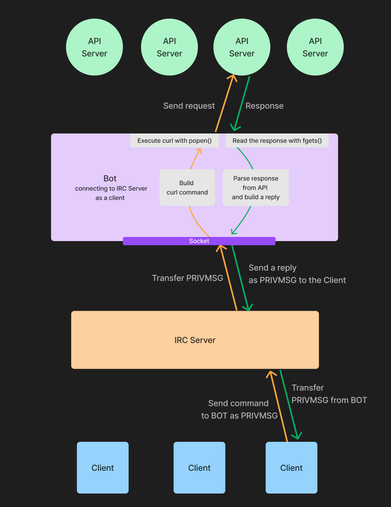

# Our bot implementation using API requests
To address the following constraints, communication with the IRC server is handled via sockets, while communication with the API server is performed by executing curl with popen and reading the output using the fgets function. All incoming messages are monitored using poll.

- C++98 (Third-party libraries are prohibited).
- Most API servers require HTTPS communication; HTTP communication does not yield the expected response.



## 1. Create a socket and connect to IRC Server

Create a socket to **communicate with the IRC Server** using `socket()`

## 2. Connect to IRC Server

Connect to the IRC server using a socket (connect()), then wait for the connection to be established using a temporary poll with a timeout of 10,000 milliseconds.

## 3. Listen to requests from IRC Server

Using another `poll`, the bot continuously listens for new requests from the IRC server sent as `PRIVMSG`.

## 4. Process requests

### a. Validate the request

Determinate if the request received from the Serve is valid to trigger an API request.

### b. Send an API request 

Construct a curl command to send a request.
Execute the command using popen and stores the file pointer and file descriptor in the  BotRequest structure object.   
Also add the corresponding file descriptor to a `poll` to monitor the response.

### c. Wait for response from API server

The response for each request is monitored using poll.   
In case the set timeout is reached, an error message is sent to the client via IRC Server, and the request is removed.


### d. Read the response from API server

When poll detects a response, the content is read using `fgets()`and parsed.
  
#### Parse the response
Some APIs may return a response in JSON format.

Response in JSON format might be parsed using string manipulation.
JSON format responses may consist of `headers` and `a body`. The headers and body are usually separated by a blank line.

Example of response (source: https://jsonapi.org/examples/):
```JSON

HTTP/1.1  200 OK
Content-Type: application/vnd.api+json

{
  "data": [{
  "type": "articles",
  "id": "1",
  "attributes": {
    "title": "JSON:API paints my bikeshed!",
    "body": "The shortest article. Ever.",
    "created": "2015-05-22T14:56:29.000Z",
    "updated": "2015-05-22T14:56:28.000Z"
    },
  "relationships": {
    "author": {
      "data": {"id": "42", "type": "people"}
      }
    }
  }],
  "included": [
    {
      "type": "people",
      "id": "42",
      "attributes": {
        "name": "John",
        "age": 80,
        "gender": "male"
      }
    }
  ]
}

```

> [!CAUTION]
>Don't forget to handle errors as connection failures, timeouts, or HTTP error codes.

### f. Send back the response to IRC server

The bot sends the response to the client via the IRC server as a PRIVMSG.   
After sending the response, the process created by `popen()` should be closed using `fclose()`.

## 5. Close the socket

Before exiting from the program, close the sockets


## Important notes

**Buffer management**: Since responses from API server may be large, proper buffer management is required. If the response is too large to receive in one go, the bot needs to receive in multiple times.
