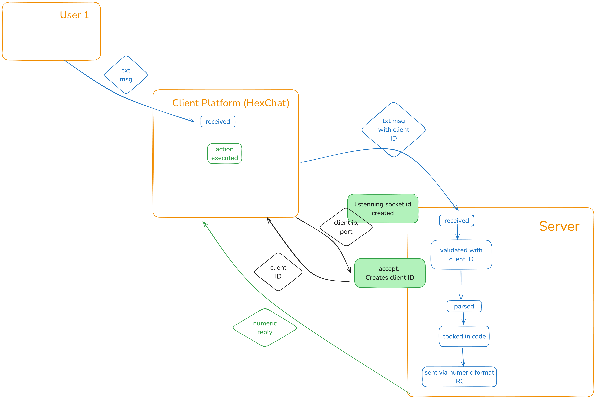

##Steps for IRC socket creation with polling##

A. Create the server socket(listening):

1. create a socket with the socket() system call. it will be used for the client to connect to the server , who will use accept()
2. add options (non blocking, reuse address, etc) to the socket with setsockopt() and fcntl()
3. bind() function to assign a specific address and port to a socket
4. listen() function to make the socket a “listening” socket

After the socket is created, it is ready to accept incoming connections. 

we need poll() to monitor the file descriptors for events, without blocking them (non-blocking mode). poll() prevents accept() and recv() from blocking the program execution.

B. Use poll_fd to track the clients events:

1. register the socket fd in the a newPollfd structure. This structure is used to store the file descriptors that you want to monitor for events. mark the events as POLLIN to listen to the entering data. revents will be used to store the events that are triggered.
2. make a loop to monitor the events. there will be two events categories : accept connection and handle clients. 

C. create the client socket (accept connection):

1. when a client tries to connect, the server stores its data via the function accept(). it takes in param : 
- the fd from the server socket (previously configured on a listen mode)
- the address of the client(ip, port) stored in the structure sockaddr_in

2. accept() return a new client socket fd. this fd is stored in the pollfd structure to be monitored by poll(). it will be used to send and receive data from the client.

D. Received new data from a registered client
1. prepare a char array buff to store the received data (init the buff with 0)
2. call recv() to receive the data from the client socket specified by the file descriptor. 
4. use send() to send a numeric reply and make the client do the action. (hexchat)

